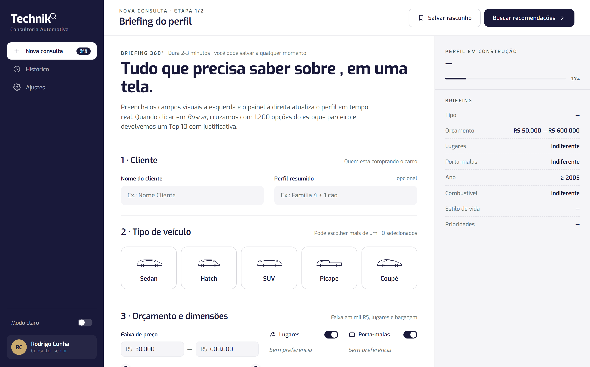

# Technik — Automotive Consultancy

An AI-assisted tool for car-buying consultants. A consultant fills a visual **briefing** about the client (budget, body type, seats, trunk, lifestyle, priorities), and Technik cross-references the partner stock to return a justified **Top 10** — each result enriched with images and current **FIPE** prices. Free-text notes like "family of 4 + a dog" are interpreted by an LLM to sharpen the profile.



## Features

- **Guided briefing + AI profiling** — a visual, step-by-step form builds the client profile in real time; free-text notes are interpreted by an LLM.
- **Smart matching** — fuzzy search over the catalog with [Fuse.js](https://fusejs.io/) plus a recommendation layer that returns a ranked Top 10.
- **FIPE price lookup** — fetches current Brazilian reference prices, with a local cache to avoid re-querying on every search.
- **Image pipeline** — resolves, validates and optimizes vehicle images (via [sharp](https://sharp.pixelplumbing.com/)), with caching.
- **Visual panel** — a results/comparison UI (`Technik - Painel Visual.html`, `results.jsx`, `design-canvas.jsx`).

## Tech stack

- **Backend:** Node.js + Express (ES modules)
- **AI:** OpenAI API for query classification & recommendations
- **Data:** Supabase (catalog + cached consultations), Fuse.js for search
- **Images:** sharp, custom image providers/validator
- **Tooling:** Playwright (scraping/catalog build scripts)

## Project structure

```
server/
├── index.js            # Express entry point
├── classify.js         # LLM query classification
├── match.js            # catalog matching
├── recommend.js        # recommendation logic
├── fipe.js             # FIPE price lookup
├── image*.js           # image cache / providers / validation
├── catalog.js          # catalog access
├── data/catalog.json   # vehicle catalog
└── scripts/            # catalog & image build / diagnostics
data.js, results.jsx, design-canvas.jsx, brand-styles.css   # front-end panel
```

## Getting started

```bash
cd server
npm install
cp .env.example .env   # add OpenAI + Supabase keys
npm run dev            # starts the API (node --watch index.js)
```

> Requires `OPENAI_API_KEY` and Supabase credentials. See `server/scripts/` for building the catalog and pre-caching images.

## Status

Work in progress / personal project.
